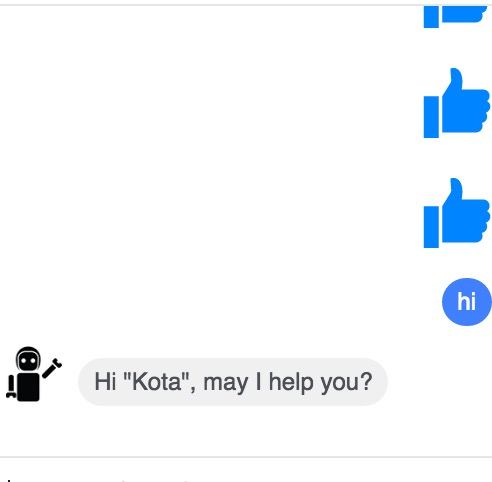

# facebook-chatbot-template
minimal facebook chatbot starter



# Instllation
```
npm install
npm start
```

# Deployment
```
# please install heroku cli
heroku create
git push heroku master
```

# Credits
Inspired by [http://x-team.com/2016/04/how-to-get-started-with-facebook-messenger-bots/](http://x-team.com/2016/04/how-to-get-started-with-facebook-messenger-bots/)

